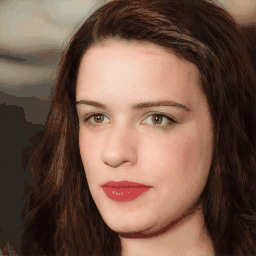
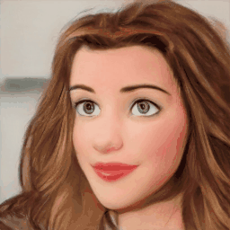

<div align="center">

<h1>
E3DGE: Self-Supervised Geometry-Aware Encoder for Style-based 3D GAN Inversion
</h1>

<div>
    <a href='https://github.com/NIRVANALAN' target='_blank'>Yushi Lan</a><sup>1</sup>&emsp;
    <a href='' target='_blank'>Xuyi Meng</a><sup>1</sup>&emsp;
    <a href='https://williamyang1991.github.io/' target='_blank'>Shuai Yang</a><sup>1</sup>&emsp;
    <a href='https://www.mmlab-ntu.com/person/ccloy/' target='_blank'>Chen Change Loy</a>
    <sup>1</sup> &emsp;
    <a href='https://daibo.info/' target='_blank'>Bo Dai</a>
    <sup>2</sup>
</div>
<div>
    S-Lab, Nanyang Technological University<sup>1</sup>;
    &emsp;
    Shanghai Artificial Intelligence Laboratory <sup>2</sup>
    <!-- ; <sup>*</sup>corresponding author -->
</div>

<br>

<h4>
E3DGE is an encoder-based 3D GAN inversion framework that yields high-quality shape and texture reconstruction.
</h4>

<table>
<tr>
    <!-- <td></td> -->
     <td rowspan="2"></td>
    <td></td>
    <td></td>
    <td></td>
    <td></td>
</tr>

<tr>
    <!-- <td></td> -->
    <!-- <td></td> -->
    <td></td>
    <td></td>
    <td></td>
    <td></td>
</tr>

<tr>
    <td align='center' width='20%'>Input</td>
    <td align='center' width='20%'>Inversion</td>
    <td align='center' width='20%'>Editing <br> (-Smile)</td>
    <td align='center' width='20%'>Editing <br> (+Smile)</td>
    <td align='center' width='20%'>Toonify</td>
</tr>

</table>

For more visual results, go checkout our <a href="https://nirvanalan.github.io/projects/E3DGE/index.html" target="_blank">project page</a> :page_with_curl:

Codes coming soon :facepunch:
<!-- This repository will contain the official implementation of _E3DGE: 
Self-supervised Geometry-Aware Encoder for Style-based 3d GAN Inversion_. -->

---

<h4 align="center">
  <a href="https://nirvanalan.github.io/projects/E3DGE/index.html" target='_blank'>[Project Page]</a> •
  <a href="https://arxiv.org/abs/2212.07409" target='_blank'>[arXiv]</a> •
  <a href="https://drive.google.com/file/d/1yDkJfJOLeVlON7ZdRSnR34Ra_ikTVI0A/preview" target='_blank'>[Demo Video]</a>
</h4>

</div>

## Citation
If you find our work useful for your research, please consider citing the paper:
```
@article{lan2022e3dge,
  title={E3DGE: Self-Supervised Geometry-Aware Encoder for Style-based 3D GAN Inversion},
  author={Lan, Yushi and Meng, Xuyi and Yang, Shuai and Loy, Chen Change and Dai, Bo},
  journal={arXiv preprint arXiv:2212.07409},
  year={2022}
}
```

## License

Distributed under the S-Lab License. See `LICENSE` for more information.

<!-- ## Acknowledgements

This study is supported by ... -->