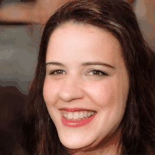

<div align="center">

<h1>
E3DGE: Self-Supervised Geometry-Aware Encoder for Style-based 3D GAN Inversion</strong>
</h1>

<div>
    <a href='https://github.com/NIRVANALAN' target='_blank'>Yushi Lan</a><sup>1</sup>&emsp;
    <a href='' target='_blank'>Xuyi Meng</a><sup>1</sup>&emsp;
    <a href='https://williamyang1991.github.io/' target='_blank'>Shuai Yang</a><sup>1</sup>&emsp;
    <a href='https://www.mmlab-ntu.com/person/ccloy/' target='_blank'>Chen Change Loy*</a>
    <sup>1</sup> &emsp;
    <a href='https://daibo.info/' target='_blank'>Bo Dai</a>
    <sup>2</sup>
</div>
<div>
    S-Lab, Nanyang Technological University<sup>1</sup>;
    &emsp;
    Shanghai Artificial Intelligence Laboratory <sup>2</sup>
    ; <sup>*</sup>corresponding author
</div>

<div>
<a target="_blank" href="https://colab.research.google.com/github/nirvanalan/E3DGE/blob/main/notebook/CVPR23_E3DGE_Demo.ipynb">
  
</a>
<a href="https://hits.seeyoufarm.com"></a>
</div>
<br>
<!-- <h4> -->
<strong>
E3DGE is an encoder-based 3D GAN inversion framework that yields high-quality shape and texture reconstruction.
</strong>
<!-- </h4> -->

<table>
<tr></tr>
<tr>
    <!-- <td></td> -->
     <td rowspan="2"></td>
    <td></td>
    <td></td>
    <td></td>
    <td></td>
</tr>

<tr>
    <!-- <td></td> -->
    <!-- <td></td> -->
    <td></td>
    <td></td>
    <td></td>
    <td></td>
</tr>

<tr>
    <td align='center' width='20%'>Input</td>
    <td align='center' width='20%'>Inversion</td>
    <td align='center' width='20%'>Editing <br> (-Smile)</td>
    <td align='center' width='20%'>Editing <br> (+Smile)</td>
    <td align='center' width='20%'>Toonify</td>
</tr>
<tr></tr>
</table>

<!-- <br> -->

For more visual results, go checkout our <a href="https://nirvanalan.github.io/projects/E3DGE/index.html" target="_blank">project page</a> :page_with_curl:

<strike>
Codes coming soon :facepunch:
</strike>

This repository contains the official implementation of _E3DGE: 
Self-supervised Geometry-Aware Encoder for Style-based 3d GAN Inversion_.

---

<h4 align="center">
  <a href="https://nirvanalan.github.io/projects/E3DGE/index.html" target='_blank'>[Project Page]</a> •
  <a href="https://arxiv.org/abs/2212.07409" target='_blank'>[arXiv]</a> •
  <a href="https://drive.google.com/file/d/1yDkJfJOLeVlON7ZdRSnR34Ra_ikTVI0A/preview" target='_blank'>[Demo Video]</a> •
  <a href="https://colab.research.google.com/github/nirvanalan/E3DGE/blob/main/notebook/CVPR23_E3DGE_Demo.ipynb" target='_blank'>[Colab Demo]</a> 
</h4>
</div>

## :mega: Updates

[06/2023] Inference and training codes on FFHQ with StyleSDF base model are released, including colab demo.

[03/2023] E3DGE is accepted to CVPR 2023 :partying_face:! 


## :dromedary_camel: TODO

- [x] Release the inference and training code.
- [x] Release the colab demo.
- [ ] Release Hugging face demo.
<!-- - [ ] Release SG2/PTI optimization-based inversion code using StyleSDF. -->
- [ ] Release pre-traind models using EG3D as the base model.
- [ ] Release video inversion code.

## :handshake: Citation
If you find our work useful for your research, please consider citing the paper:
```
@inproceedings{lan2022e3dge,
  title={E3DGE: Self-Supervised Geometry-Aware Encoder for Style-based 3D GAN Inversion},
  author={Lan, Yushi and Meng, Xuyi and Yang, Shuai and Loy, Chen Change and Dai, Bo},
  booktitle={Computer Vision and Pattern Recognition (CVPR)},
  year={2023}
}
```

## :desktop_computer: Requirements

NVIDIA GPUs are required for this project.
We have test the inference codes on NVIDIA T4 and NVIDIA V100.
The training codes have been tested on NVIDIA V100 (32GB). 
We recommend using anaconda to manage the python environments.

```bash
conda create --name e3dge python=3.8
conda activate e3dge
conda install -c conda-forge ffmpeg
conda install pytorch==1.9.0 torchvision==0.10.0 torchaudio==0.9.0 cudatoolkit=10.2 -c pytorch
conda install -c fvcore -c iopath -c conda-forge fvcore iopath
pip install -r requirements.txt
```

## :running_woman: Inference

### Download Models

The pretrain 3D generators and encoders are needed for inference.

The following scripts download pretrain models and test dataset.


```python
python download_models.py # download pre-trained models
python download_test_data.py # download preprocessed CelebA-HQ test set
```

#### Commands

<strong>Note that to render the mesh, 15GB GPU memory is required.</strong>

do novel view synthesis given 2D images (on some demo images):
```bash
bash scripts/test/demo_view_synthesis.sh
```

Conduct semantics editing (on some demo images):
```bash
bash scripts/test/demo_editing.sh
```

3D Toonifications with our pre-triaind encoder:
```bash
bash scripts/test/demo_toonify.sh
```

Reproduce the results in Table 1 (Quantitative performance on CelebA-HQ.)

```bash
bash scripts/test/eval_2dmetrics_ffhq.sh
```

More explaination of the inference scripts are included in [scripts/test/RUN.md](scripts/test/RUN.md).

## :train: Training

For all the experiments, we use `4 V100 GPUs` by default.

### FFHQ

#### Download Pre-trained generators and pre-processed test set

```python
python download_models.py # download pre-trained models
python download_datasets.py # download preprocessed CelebA-HQ test set
```

#### Commands

stage 1 training (Sec. 1, Self-supervision for plausible shape inversion.)
```
bash scripts/train/ffhq/stage1.sh
```

stage 2.1 training (Sec. 2+3, Local feature fusion for high-fidelity inversion. Using 2D alignment only)

```
bash scripts/train/ffhq/stage2.1.sh
```

stage 2.2 training (Sec. 3, Hybrid feature alignment for high-quality editing)

```
# update the ffhq/afhq dataset path in the bash if adv_lambda != 0 (enables adversarial training)
bash scripts/train/ffhq/stage2.2.sh
```

Intermediate test results will be saved under `${checkpoints_dir}` every `2000` iterations, and the train results will be saved every `100` iterations. 
For the training results, from the left to right is the (synthetic) ground truth images, `E0` reconstruction (64x64 resolution), residual, aligned residual and the `E1` reconstructionss (both thumb image and SR image).
For the test results, the first line is the real images ground truth images and the second line is the texture inversion results.

To inference the trained models, please refer to the **Inference** section.

Support for more datasets coming soon...


## :hammer_and_wrench: Misc helper scripts

### Script to generate the demo video
I have uploaded the python script to export the demo video here [`gallary_video.py`](helper_scripts/gallary_video.py). You can modify the video paths and use it in your own project.

### Script to evaluate inversion results

Though our test_ae.py automatically calculates the inversion metrics, you can also simply run this script [`calc_losses_on_images.py`](helper_scripts/calc_losses_on_images.py) and modify the `--data_path` and `--gt_path` argument to calculate the inversion performance of your results.

## :raised_hands: Acknowledgements

This study is supported under the RIE2020 Industry Alignment Fund Industry Collaboration Projects (IAF-ICP) Funding Initiative, as well as cash and in-kind contribution from the industry partner(s). It is also partially supported by Singapore MOE AcRF Tier 2 (MOE-T2EP20221-0011) and the NTU URECA research program.

This project is built on source codes shared by [StyleSDF](https://github.com/royorel/StyleSDF).

## :newspaper_roll:  License

Distributed under the S-Lab License. See `LICENSE` for more information.

## Contact

If you have any question, please feel free to contact us via `yushi001@e.ntu.edu.sg`.